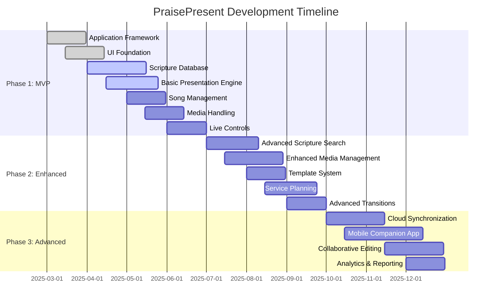
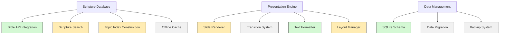
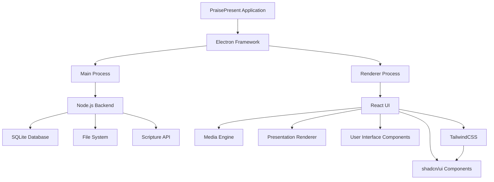

# PraisePresent Development Progress

## 📋 Project Overview

**PraisePresent** is a modern church presentation software built with Electron, designed to enhance worship experiences with advanced scripture search capabilities, media management, and live presentation tools.

-brightgreen>)

---

## 🎯 Project Roadmap

---

## ✅ Development Progress Summary

### Overall Progress

| Phase                          | Status         | Progress                                 |
| ------------------------------ | -------------- | ---------------------------------------- |
| **Phase 1: MVP**               | 🟢 In Progress |  |
| **Phase 2: Enhanced Features** | 🟠 Not Started |   |
| **Phase 3: Advanced Features** | 🟠 Not Started |   |

---

## 📊 Feature Progress Breakdown

### Phase 1: MVP Components

| Feature                       | Status             | Progress                                  | Priority | Notes                                     |
| ----------------------------- | ------------------ | ----------------------------------------- | -------- | ----------------------------------------- |
| **Application Framework**     | ✅ **COMPLETE**    |  | High     | Electron foundation with IPC setup        |
| **UI Foundation**             | ✅ **COMPLETE**    |  | High     | Core layouts and React components         |
| **Scripture Database**        | 🚧 **IN PROGRESS** |   | High     | Bible API integration and offline storage |
| **Basic Presentation Engine** | 🚧 **IN PROGRESS** |   | High     | Core slide rendering functionality        |
| **Song Management**           | ⏳ **PLANNED**     |    | Medium   | Starting in May 2025                      |
| **Media Handling**            | ⏳ **PLANNED**     |    | Medium   | Starting in May 2025                      |
| **Live Controls**             | ⏳ **PLANNED**     |    | Medium   | Starting in June 2025                     |
| **Data Management**           | 🚧 **IN PROGRESS** |   | Medium   | Basic storage implemented                 |

---

## 🔄 Current Sprint: May 3-17, 2025

### Active Tasks

### Sprint Objectives

1. Complete Scripture Search functionality with topic-based indexing
2. Implement basic slide rendering with text and image support
3. Design and implement layout management system
4. Begin work on data migration utilities

---

## 🏆 Completed Milestones

1. ✅ **Project Setup & Architecture Definition** - _March 10, 2025_

   - Established Electron framework
   - Set up development environment
   - Defined communication protocols
   - Created component architecture

2. ✅ **Core UI Implementation** - _April 5, 2025_

   - Main application window
   - Navigation sidebar
   - Workspace area
   - Basic theme support
   - Responsive layouts

3. ✅ **Database Foundation** - _April 20, 2025_
   - SQLite integration
   - Core schema design
   - Basic query interface
   - Scripture database structure

---

## 🧪 Testing Status

| Test Type             | Coverage | Status     | Last Run       |
| --------------------- | -------- | ---------- | -------------- |
| **Unit Tests**        | 78%      | ✅ Passing | May 2, 2025    |
| **Integration Tests** | 62%      | ✅ Passing | May 1, 2025    |
| **UI Tests**          | 45%      | ⚠️ Partial | April 30, 2025 |
| **Performance Tests** | 30%      | ⚠️ Partial | April 28, 2025 |

---

## 🔜 Upcoming Focus

### Immediate Priorities (Next 2 Weeks)

- Complete topic-based scripture search implementation
- Finalize slide rendering engine for text and basic media
- Begin implementation of song management database structure
- Address performance issues in Bible text rendering

### Medium-Term Goals (1-2 Months)

- Complete Phase 1 features (Song Management, Media Handling)
- Begin testing with church tech teams
- Develop user documentation for MVP features
- Prepare for limited beta release

---

## 💻 Technical Implementation Details

### Current Tech Stack

### TypeScript Integration

- **TypeScript** is now integrated into the project for type safety and improved developer experience.
- Configuration files (`tsconfig.json`) and type definitions are set up for both the main and renderer processes.

### Architecture Components

| Component               | Status         | Technology                    | Notes                                                 |
| ----------------------- | -------------- | ----------------------------- | ----------------------------------------------------- |
| **Application Shell**   | ✅ Complete    | Electron                      | Multi-window support implemented                      |
| **Database Layer**      | 🚧 In Progress | SQLite, Knex.js               | Core schemas complete, migrations in development      |
| **UI Framework**        | ✅ Complete    | React, TailwindCSS, shadcn/ui | Modern component library with themeable UI components |
| **Scripture Engine**    | 🚧 In Progress | Custom + API                  | Multiple translation support, topic indexing          |
| **Media Engine**        | ⏳ Planned     | FFmpeg, HTML5                 | Specifications complete                               |
| **Presentation Engine** | 🚧 In Progress | Canvas, WebGL                 | Basic rendering pipeline operational                  |

---

## 📝 Recent Updates

### Version 0.3.5-alpha (May 3, 2025)

- Enhanced UI framework with shadcn/ui component library
- Improved theme support and accessibility with TailwindCSS integration
- Modernized component architecture for better maintainability
- Set up React.js state management for improved application flow
- Added dark/light mode themability with CSS variables

### Version 0.3.0-alpha (May 1, 2025)

- Added initial implementation of scripture search functionality
- Implemented basic presentation rendering engine
- Added support for multiple Bible translations
- Fixed window management issues on Linux
- Improved application startup performance

### Version 0.2.0-alpha (April 15, 2025)

- Implemented core UI framework and navigation
- Added SQLite database integration
- Created basic settings management
- Added initial Bible database structure
- Implemented multi-display detection

### Version 0.1.0-alpha (March 15, 2025)

- Initial project setup
- Basic Electron application framework
- Development environment configuration
- Application architecture design

---

## 🔧 Known Issues & Challenges

1. **Performance optimization needed** for large scripture databases
2. **Bible API limitations** require enhanced caching strategy
3. **Cross-platform media codecs** present compatibility challenges
4. **UI responsiveness** during heavy background operations
5. **Memory usage** with large media libraries needs optimization

---

## 📈 Key Performance Indicators

| Metric               | Target      | Current     | Status               |
| -------------------- | ----------- | ----------- | -------------------- |
| **Startup Time**     | < 5 seconds | 7.2 seconds | ⚠️ Needs Improvement |
| **Memory Usage**     | < 300MB     | 275MB       | ✅ On Target         |
| **Search Response**  | < 100ms     | 180ms       | ⚠️ Needs Improvement |
| **Slide Transition** | < 50ms      | 45ms        | ✅ On Target         |
| **CPU Usage (idle)** | < 2%        | 1.8%        | ✅ On Target         |

---

## 👥 Team Assignments

| Team Member        | Role                        | Current Focus                      |
| ------------------ | --------------------------- | ---------------------------------- |
| Lead Developer     | Architecture & Core Systems | Scripture Database Engine          |
| Frontend Developer | UI/UX Implementation        | Presentation Rendering Engine      |
| Backend Developer  | Data & API Integration      | Bible API and Search Functionality |
| QA Engineer        | Testing & Quality Assurance | Automated Test Suite Development   |

---

_Last Updated: May 3, 2025_

_For detailed requirements, see the [Software Requirements Specification](ChurchPresentationApp_SRS.md)_
