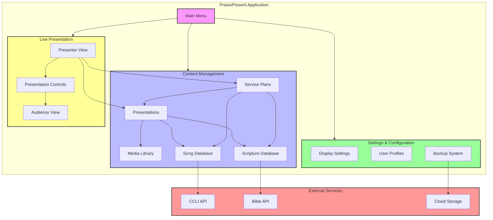

# PraisePresent System Architecture

## System Components

### 1. Content Management
- **Presentations**: Create and manage presentation slides
- **Service Plans**: Plan and organize church services
- **Media Library**: Store and manage media files
- **Song Database**: Manage song lyrics and CCLI information
- **Scripture Database**: Access and manage scripture content

### 2. Live Presentation
- **Presenter View**: Control interface for presenters
- **Audience View**: Display for congregation
- **Controls**: Navigation and presentation tools

### 3. Settings & Configuration
- **Display Settings**: Configure multiple displays
- **User Profiles**: Manage user accounts
- **Backup System**: Data backup and restore

### 4. External Services
- **CCLI API**: Song licensing and reporting
- **Bible API**: Scripture content access
- **Cloud Storage**: Backup and sync services 