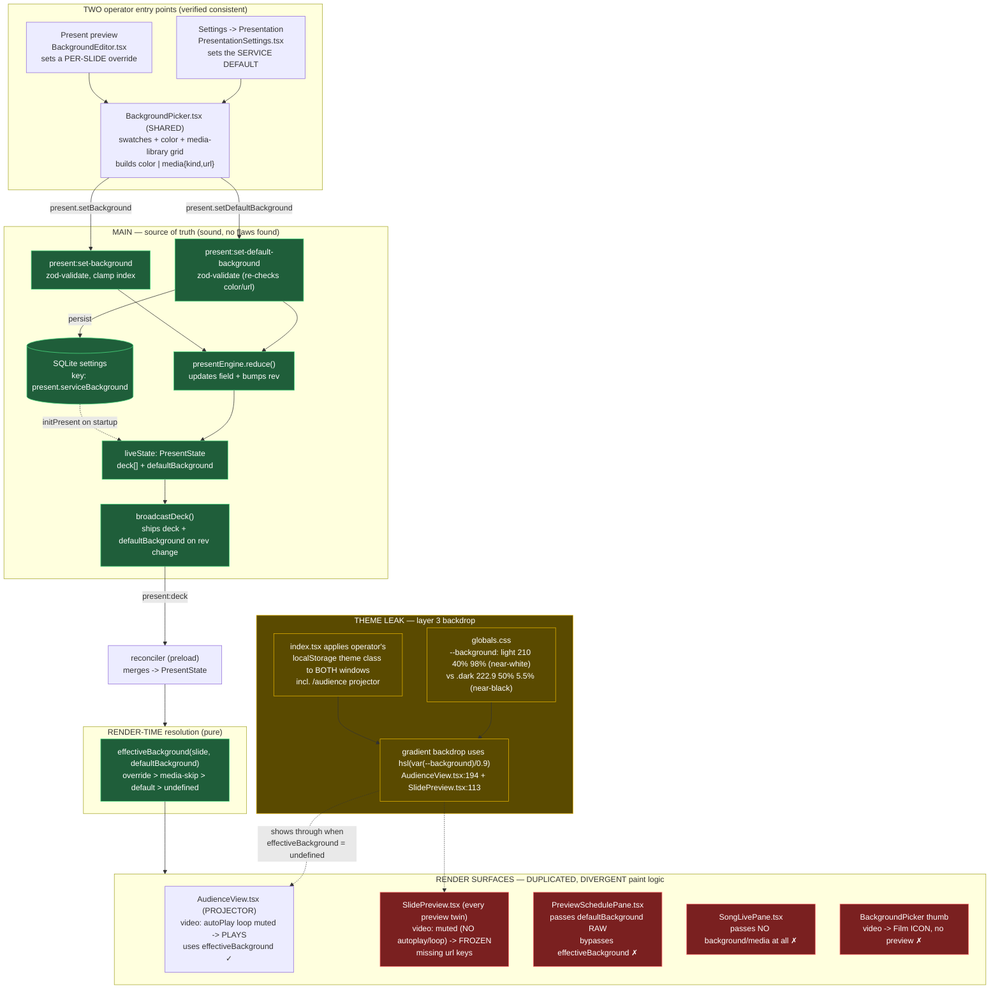

# Background Architecture — Current State & Flaws

> Produced 2026-06-30 from a first-hand read of the code by the PM agent plus four
> read-only reviewer agents (state spine · theme coupling · render surfaces · entry
> points). Companion: [`proposed-fix.md`](proposed-fix.md). Scope: how a slide's
> background is modelled, set, persisted, broadcast, resolved, and painted — and why
> the operator sees a *different scripture background in light vs dark mode* and finds
> image/video backgrounds *unreliable*.

---

## TL;DR

The **data model is sound** (one source of truth, reactive, fail-safe — agents 1 & 4
found no flaws there). The damage is at the **render + theme boundary**, and it has one
root cause expressed two ways:

1. **There are THREE background layers, but only TWO are in the domain model.** The
   third — the "gradient backdrop" shown when nothing else is set — lives only in
   component CSS and is **built from the operator's UI-theme tokens**. So the projector's
   default scripture background literally changes with light/dark mode. *(The headline bug.)*
2. **Background painting is duplicated across surfaces** instead of one shared component,
   so the preview and the projector **diverge** — most visibly, a video background plays
   on the projector but is **frozen** in every operator preview, which reads as "video
   backgrounds don't work."

Neither requires a schema change. The fix is surgical (see the companion doc).

---

## The three background layers (the mental model)

Every slide surface paints, bottom-to-top: **stage backdrop → background → media → text → reference**.
There are three ways the *background/backdrop* can be decided, in precedence order:

| # | Layer | Where it lives | Persisted? | In the data model? | Theme-independent? |
|---|-------|----------------|------------|--------------------|--------------------|
| 1 | **Per-slide override** `slide.background` | live deck (`PresentState.deck[i]`) | No (live only) | ✅ `presentSlide.background` | ✅ yes |
| 2 | **Service default** `defaultBackground` | SQLite `present.serviceBackground` + `liveState` | ✅ yes | ✅ `presentState.defaultBackground` | ✅ yes |
| 3 | **Stage backdrop** (the gradient) | hardcoded Tailwind class in 2 components | n/a | ❌ **not modelled** | ❌ **NO — theme-coupled** |

Resolution of layers 1→2 is a clean pure function,
[`effectiveBackground(slide, defaultBackground)`](../../src/shared/present/serviceBackground.ts#L54-L61):
override wins → media slide skipped → else the service default → else `undefined`. When it
returns `undefined`, **layer 3 (the gradient) shows through** — and that is where the theme leaks in.

---

## Diagram 1 — Current background architecture (as built)

Green = verified sound (data spine). Yellow = the theme leak (layer 3). Red = divergent
render surfaces that make preview ≠ projector.

---

## Flaws (each with evidence)

### F1 — The stage backdrop is theme-coupled (THE HEADLINE BUG) · severity: high
The "no background set" gradient backdrop is built from the **theme-dependent** token
`--background`:
- [`AudienceView.tsx:194`](../../src/renderer/features/presentation/AudienceView.tsx#L194) and the identical
  [`SlidePreview.tsx:113`](../../src/renderer/components/common/SlidePreview.tsx#L113) both use
  `...radial-gradient(circle_at_50%_120%, hsl(var(--background)/0.9), hsl(var(--pp-surface-live)))`.
- `--background` = `210 40% 98%` (near-white) in light `:root`
  ([`globals.css:19`](../../src/renderer/styles/globals.css#L19)) vs `222.9 50% 5.5%` (near-black) in
  `.dark` ([`globals.css:73`](../../src/renderer/styles/globals.css#L73)). `--pp-surface-live` also drifts
  (light `:root` line 51 vs `.dark` line 104).
- **Result:** the scripture slide's default backdrop is a pale bottom-glow in light mode and a dark one
  in dark mode — exactly the user's "light mode has its own background, dark mode has its own."

### F2 — The projector is coupled to the operator's UI theme · severity: high (root cause of F1)
The audience window is **not theme-isolated**. It loads the *same* bundle as the presenter —
`loadRoute(audienceWindow, '/audience')` vs `loadRoute(presenterWindow, '/')`
([`windowManager.ts:158`](../../src/main/windows/windowManager.ts#L158) / `:80`) — and that bundle's
[`index.tsx:12-17`](../../src/renderer/index.tsx#L12-L17) applies the operator's persisted
`localStorage('theme')` class to `documentElement` on **both** windows;
[`theme.tsx:23-36`](../../src/renderer/lib/theme.tsx#L23-L36) keeps it reactive. So the projector inherits
whatever theme the operator is using. **Per §5.7 the projector path must not depend on operator UI
state** — this is the architectural violation that makes F1 possible.

### F3 — The fallback backdrop is not in the domain model & is duplicated · severity: medium
Layer 3 exists only as a hardcoded Tailwind class duplicated in two files (F1's two locations).
It cannot be configured, has no schema, and any change must be hand-synced across both copies — a
§1.9 ("one way") violation and the reason the leak appears in both the projector and the preview.

### F4 — Background/media painting is duplicated across surfaces (preview ≠ projector) · severity: high
The same paint logic is reimplemented in `AudienceView.BackgroundLayer/MediaLayer`,
`SlidePreview.SlideBackgroundLayer/SlideMediaLayer`, and `BackgroundPicker.BgThumb` — and they have
**drifted**:
- **F4a — Video backgrounds are FROZEN in every preview.** Projector uses
  `<video autoPlay loop muted>` ([`AudienceView.tsx:241-254`](../../src/renderer/features/presentation/AudienceView.tsx#L241-L254));
  the preview twin uses `<video muted playsInline>` with **no `autoPlay`, no `loop`**
  ([`SlidePreview.tsx:226-233`](../../src/renderer/components/common/SlidePreview.tsx#L226-L233)). The
  operator sees a still frame while the projector shows motion → reads as "video doesn't work."
- **F4b — Missing `key={url}` in the preview twin.** AudienceView keys media/bg by `url`
  (`:232`,`:244`,`:278`,`:289`); `SlidePreview` does not (`:177`,`:188`,`:216`,`:226`), so re-picking a
  different image/video may not remount → stale background lingers.

### F5 — Some surfaces bypass `effectiveBackground` (preview shows the wrong layer) · severity: medium
- [`PreviewSchedulePane.tsx:80`](../../src/renderer/features/scripture/PreviewSchedulePane.tsx#L80) passes
  `defaultBackground` **raw**, not `effectiveBackground(slide, defaultBackground)` — a per-slide
  override is ignored in the staged preview.
- [`SongLivePane.tsx:60-66`](../../src/renderer/features/songs/SongLivePane.tsx#L60-L66) passes **no**
  `background`/`media` at all, so song slides preview as a blank gradient even when the projector shows a
  real background/media — the operator is blind to what the audience sees.

### F6 — The picker can't preview a video · severity: low
[`BackgroundPicker.tsx:154-158`](../../src/renderer/features/present/BackgroundPicker.tsx#L154-L158) renders a
`Film` icon (not a thumbnail) for video items, so the operator can't see a video before applying it —
reinforcing the "video backgrounds are broken" impression even though the pipeline is correct.

---

## What is NOT broken (so the fix is surgical)

Verified first-hand and by agents 1 & 4 — **leave these alone**:
- **One source of truth, reactive.** `defaultBackground` is stored once (SQLite `present.serviceBackground`),
  mirrored in `liveState`, persisted+dispatched atomically, reloaded at startup, and a change bumps `rev`
  so the **live** deck updates immediately on both windows. No split-brain, no `useActiveService`-style drift
  (`usePresentDeck` owns the single `present.onState` subscription).
- **Both entry points are consistent.** Settings and the per-slide editor share `BackgroundPicker`, build the
  *same* `{type:'media', kind, url}` object, pass the *same* zod validation, and the image/video `kind` is
  determined correctly ([`BackgroundPicker.tsx:143`](../../src/renderer/features/present/BackgroundPicker.tsx#L143)).
- **Fail-safe chain intact.** Unsafe colors rejected at the IPC boundary; tampered settings rows fail to `null`;
  media load error → gradient/black. The audience never shows a stack trace.
- **The audience window and `app-media://` ARE built** (contrary to a stale `audience/README.md`):
  `AudienceView.tsx` is complete and `mediaProtocol.ts` streams `app-media://` with range requests.

**Conclusion:** the background *plumbing* is good. The problem is (a) the projector borrows the operator's UI
theme, and (b) the slide surface is painted by several drifting copies instead of one. Both are fixed at the
render/theme boundary with **no schema migration**. See [`proposed-fix.md`](proposed-fix.md).
