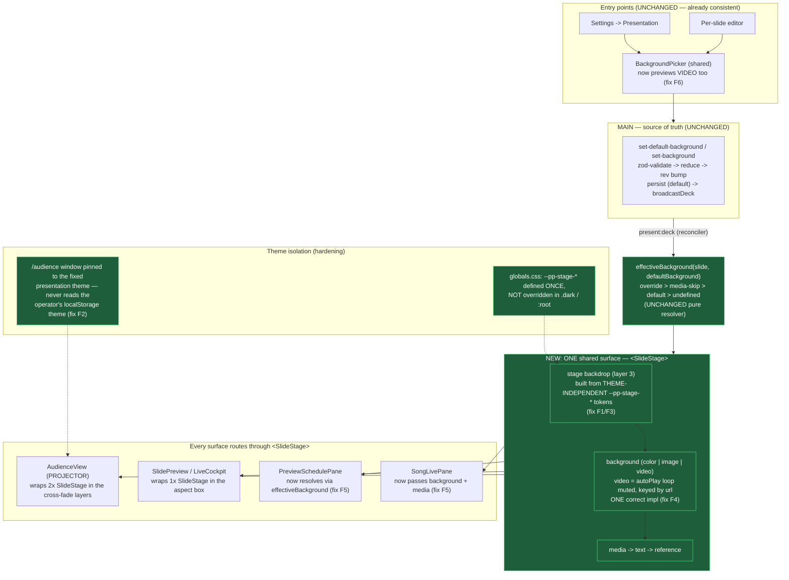

# Background Architecture — Proposed Fix

> **STATUS: IMPLEMENTED 2026-06-30** on branch `phase-ux/background-theme-decouple` (T1–T5 below).
> Reviewer + security SIGN-OFF; gate green (tsc 0 · eslint 0 · prettier · 336/336 unit · 3/3 projector
> e2e). See `tasks/completed/2026-06-30_background-architecture-review.md`. New shared surface:
> `src/renderer/components/common/SlideStage.tsx`.
>
> Companion to [`current-architecture.md`](current-architecture.md). Closes the theme leak
> (F1/F2) and the preview≠projector divergence (F3–F6) with **no schema migration** — the
> data spine is already sound, so every change is at the render/theme boundary.

---

## Three design principles

1. **The projector output is theme-independent.** What the audience sees must be identical
   whether the operator runs the app in light or dark mode. The live "stage" is its own visual
   domain, not a skin of the operator UI.
2. **One slide surface, painted once.** A single shared component renders *every* slide twin —
   projector and all previews — so "what the operator previews" is, by construction, "what the
   audience sees." No second implementation to drift.
3. **The stage backdrop is an explicit, named layer** in the three-tier precedence
   (per-slide override → service default → **stage backdrop**), built from presentation tokens,
   not an accidental by-product of UI-theme CSS.

---

## Diagram 2 — Proposed background architecture

---

## The changes

### C1 — Theme-independent stage tokens (kills F1; smallest possible first step)
In [`globals.css`](../../src/renderer/styles/globals.css), add presentation-stage tokens defined **once**
(in `:root`, and **not** re-declared in `.dark`) so they resolve to the same value in either theme — e.g.
`--pp-stage-base`, `--pp-stage-glow`, `--pp-stage-edge` carrying the intended dark "stage" look (today's
dark-mode appearance, which is the approved design). Rebuild the backdrop gradient from these instead of
`--background` / `--pp-surface-live`. This alone makes the backdrop identical in light vs dark — even before
the component refactor — because it no longer references any token the theme overrides. (§5.6: tokens, no hex.)

### C2 — Extract one shared `<SlideStage>` surface (kills F3, F4, F5, F6)
Create `src/renderer/components/common/SlideStage.tsx`: the single inner slide surface that paints
**stage backdrop → background → media → text → reference**, with:
- the **one** correct color/image/video renderer — video is `autoPlay loop muted playsInline object-cover`,
  every media/bg element `key`ed by `url` (folds in F4a + F4b);
- `effectiveBackground(slide, defaultBackground)` resolved **inside** the component, so a caller cannot
  bypass it (folds in F5);
- a `scale` variant (`full` for the projector, `preview`/`thumb` for the twins) via a prop/CSS, not a fork;
- local `onError` fail-safe to the stage backdrop / black (§5.7 preserved).

Then route the surfaces through it and **delete** the now-duplicated layers (§1.9, leave-it-cleaner):
- `AudienceView` keeps its double-buffer cross-fade + safe-area shell and renders two `<SlideStage>`s inside it.
- `SlidePreview` keeps its aspect box and renders one `<SlideStage>`.
- `LiveCockpit`, `PreviewSchedulePane`, `SongLivePane` render through `SlidePreview`/`SlideStage` and pass the
  real `slide` + `defaultBackground` (so `PreviewSchedulePane.tsx:80` and `SongLivePane.tsx:60` stop dropping
  the override/media).
- `BackgroundPicker`'s video thumbnail reuses the same bg renderer (fix F6).

### C3 — Theme-isolate the audience window (hardening; kills F2 at the root)
The `/audience` route must not inherit the operator's `localStorage('theme')`. Pin it to the fixed
presentation theme (the stage look) — e.g. the audience entry forces a constant class and skips
[`index.tsx:12-17`](../../src/renderer/index.tsx#L12-L17)'s operator-theme application / `ThemeProvider` for
that route. With C1 the *backdrop* is already safe; C3 guarantees **nothing else** (text/border tokens, future
additions) can ever leak onto the projector. Touches the audience window → **security review** (§7).

---

## Why this closes every flaw

| Flaw (current) | Fix | Why it's closed |
|---|---|---|
| **F1** backdrop theme-coupled (`--background`) | C1 stage tokens defined once | Backdrop no longer references any token the theme overrides → identical light/dark |
| **F2** projector inherits operator theme | C3 pin `/audience` to fixed theme | Operator theme is never applied to the projector window |
| **F3** backdrop not modelled / duplicated | C1 + C2 (one token set, one component) | Backdrop is a single named layer painted in one place |
| **F4a** video frozen in previews | C2 single video renderer (`autoPlay loop`) | Preview uses the *same* element as the projector → it plays |
| **F4b** missing `key={url}` in preview | C2 keys every media/bg by url | Re-picking media remounts → no stale background |
| **F5** surfaces bypass `effectiveBackground` | C2 resolves inside `<SlideStage>` | Callers can't bypass it; song/staged previews show the true layer |
| **F6** picker can't preview video | C2 reuse bg renderer in the thumb | Operator sees the video before applying |

The **data model, IPC, persistence, and `effectiveBackground` precedence are untouched** — verified sound, so
they carry forward unchanged.

---

## Risk & verification

- **No schema migration.** `presentState`, `slideBackground`, every IPC channel and the reducer are unchanged.
- **Additive CSS + one new component**, then deletion of the duplicated layers (net simpler).
- **Security:** only C3 touches the audience window; no new IPC, no new privilege, CSP unchanged → a focused
  security sign-off confirming the projector still can't be driven by renderer/UI state and still fails safe.
- **Tests (§5.8):**
  - Unit: `effectiveBackground` (existing) stays green; new `<SlideStage>` tests — color/image/video paint,
    fallback-to-backdrop, load-error fail-safe, url-keying.
  - **Regression guard for F1:** a visual/e2e check that the projector slide is pixel-identical with the
    operator in light vs dark mode.
  - e2e: a video background set from Settings *and* from the per-slide editor **plays** on the projector **and**
    in the operator preview.

---

## Implementation breakdown (separate CAMS tasks, opened only after you approve)

| Task | Type | Does |
|---|---|---|
| **T1** stage tokens | implementer | C1 — theme-independent `--pp-stage-*`; rebuild the backdrop gradient. Kills F1 immediately. |
| **T2** SlideStage extract | restructure + implementer | C2 — one shared surface; route AudienceView + SlidePreview through it; delete duplicated layers; video autoplay/loop/keys. |
| **T3** fix bypasses | implementer | C2 cont. — PreviewSchedulePane + SongLivePane resolve via `effectiveBackground` & pass media; picker previews video. |
| **T4** audience theme isolation | implementer + **security** | C3 — pin `/audience` to the fixed presentation theme. |
| **T5** tests | tester | SlideStage unit + light-vs-dark projector regression + video-plays-in-preview e2e. |
| — review | reviewer (+ security on T4) | §7 sign-off; observe in the running app (§6). |

**Recommended order:** T1 first (one-line-ish, kills the headline bug and is independently shippable) → T2 →
T3 → T4 → T5. T1 and T4 each independently neutralize the theme leak, so doing both is defense-in-depth.
