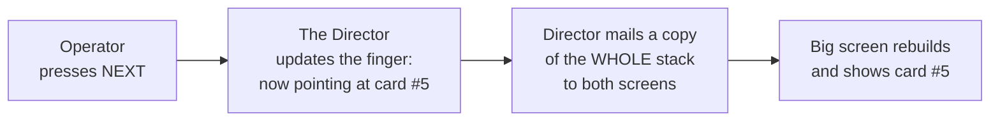
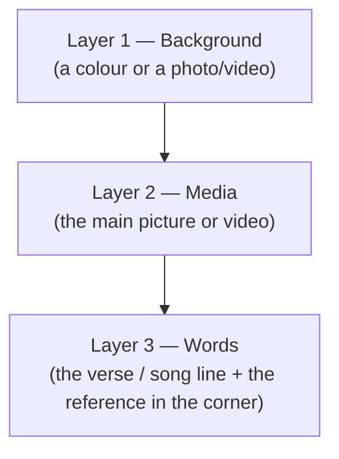
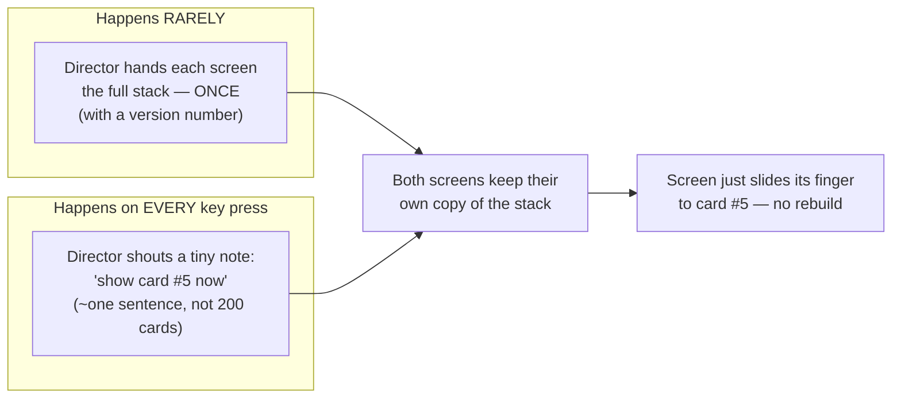

# The Rendering Engine, Explained Simply

> A plain-English guide to how PraisePresent puts things on the projector — and how
> we're making it smooth on old, weak church computers. No jargon required. If you can
> picture a stack of cards and one person holding the script, you're ready.

---

## 1. The one big idea (read this twice)

> **There is exactly ONE answer to the question "what is on the projector right now?"
> and it lives in ONE place. Everyone else just asks that place. Nobody guesses.**

That "one place" is the part of the app we call **the Director** (technically: the *main
process*). The Director is the single source of truth. The operator's laptop screen and
the big projector screen are both just **followers** — they show whatever the Director
says, and they never invent anything on their own.

This is the whole point of the rendering engine: **one uniform thing on screen, and the
entire app is aware of what it is — without anyone having to guess or stay in sync by
hand.** Get this idea and the rest is detail.

---

## 2. The cast of characters

Think of running a live service like running a small stage play:

| In the app | Think of it as | Job |
| --- | --- | --- |
| **The Director** (main process) | The stage manager holding the only script | Decides what's on screen. The single source of truth. |
| **Operator window** | The control booth monitor | Where the person running the service clicks buttons. |
| **Audience window** | The big screen the congregation sees | Shows the final result. Must *never* show a crash. |
| **A Slide** | One index card | Some words, maybe a picture/video behind them, maybe a "John 3:16" in the corner. |
| **The Deck** | The whole stack of cards | All the slides lined up — e.g. every verse of a passage, one per card. |
| **The Cursor** | A finger pointing at one card in the stack | Which slide is showing *right now*. |

Everything you can put on screen — a Bible verse, a song line, a photo, a looping video
background — ends up as the **same kind of card** (a "slide"). That uniformity is
deliberate: the app only ever has to know how to show *one kind of thing*.

> **Heads-up / honest gap:** today there is **no "document" card** — no PDF, no
> PowerPoint, no Word file. The app can show text, an image, a video, or audio. If we
> want to project a PDF or a slideshow file, that's a *brand-new kind of card* we'd have
> to build — it doesn't exist yet.

---

## 3. How a slide gets on screen today — step by step

Picture the operator pressing the **→ (next)** key:

1. The operator presses a key.
2. The request goes to the **Director** (and *only* the Director changes anything — the
   screens can't change themselves).
3. The Director moves the cursor (the finger) to the next card.
4. The Director then **sends the entire stack of cards** to both screens.
5. Each screen throws away what it had and **rebuilds the whole thing** to show the new card.

Each card itself is painted in three stacked layers, bottom to top, like a collage:

That's it. Scripture, songs, AI suggestions — all of them become this same
three-layer card. **One uniform thing.**

---

## 4. Why this is slow on old church computers

Look again at step 4 above. **Every single time** the operator moves one card forward,
the Director photocopies the *entire stack* and mails it to both screens — even though
only the **finger** moved.

Imagine a 200-verse passage. Every tap of the spacebar:

- copies all 200 cards,
- sends them twice (once to each screen),
- and makes each screen **tear down and rebuild the whole display** from scratch.

A few more wasteful habits we found in the current version:

- **Videos restart for no reason.** Because the screen rebuilds everything, a background
  video can jump back to the start even when nothing about it changed.
- **The "fade" isn't really a fade.** Instead of one slide dissolving into the next, the
  old slide vanishes and the new one fades up *from black*. It looks like a flicker, not a
  smooth blend.
- **Big media is decoded live.** A giant 4K photo or video is crunched by the weak old
  computer *at the moment it's shown* — exactly when you can least afford it.

None of this is *broken* — it's just wasteful. On a fast machine you don't notice. On a
15-year-old church PC with a weak graphics chip, it stutters.

---

## 5. The new design — what we're building

Same big idea (one Director, one source of truth). We just stop being wasteful. Three
plain-English changes:

### Change 1 — Hand out the stack once, then just shout the number

The screens already have the whole stack. So advancing a slide means sending a **tiny
note** ("show #5") instead of the **whole stack**. The version number is just a safety
check so a screen never shows a card from an old, replaced stack.

This is the single biggest win, and it's almost free: most of the time we now send a
sentence instead of a book.

### Change 2 — A real, smooth cross-fade (two layers)

Instead of one slide and a black flash, we keep **two layers** — the one going out and the
one coming in — and gently blend between them. The graphics chip handles this kind of
blend very cheaply, so it stays smooth even on weak hardware. (And a "fade" finally looks
different from a "dissolve.")

### Change 3 — Shrink big media *when it's imported*, not when it's shown

When someone adds a photo or video to the library, we **pre-shrink it once** to the exact
size the projector needs (and a lightweight format). Then at show time the old computer
just displays an already-small file — no heavy crunching during the service. Likely the
single biggest comfort win for weak machines.

Plus: **videos stop restarting** when nothing about them changed, because we no longer
rebuild the whole screen for a simple finger move.

---

## 6. So *why* is it gentle on weak hardware? (the short list)

Put plainly, weak computers struggle with three things: **moving lots of data**, **redrawing
the screen**, and **crunching big files**. The new design attacks all three:

1. **Less data moves.** A tiny "show card #5" note instead of the whole stack, on every
   key press.
2. **Less redrawing.** The screen slides its finger instead of tearing down and rebuilding
   the entire display.
3. **No heavy crunching live.** Big images/videos are shrunk once on import, so nothing
   heavy happens during the service.
4. **The graphics chip does the smooth bits.** Cross-fades run on the GPU's cheap path, not
   the CPU.
5. **Nothing restarts by accident.** Videos keep playing through a slide change instead of
   jumping back to the start.

And we don't *guess* that this helps — we **measure it**. The first task builds a way to
fake a slow machine (slow CPU, little memory, weak graphics) and record real numbers:
how fast a key press reaches the screen, how smooth the fade is, how much memory we use —
**before vs. after**. Every decision is backed by a number, not an opinion.

---

## 6b. "But what about a HUGE file? And what about powerful computers?"

Two fair worries. Both have clean answers.

### Worry 1 — Someone drops a 30 GB video onto a 4 GB-RAM machine

First, the reassuring part: **a big file does not, by itself, crash a computer — only
loading the *whole thing into memory* does.** And we never do that. When the video plays,
the app streams it in small chunks (think buffering a YouTube clip), not by swallowing all
30 GB at once. When we shrink it on import, the converter reads it a frame at a time, so its
memory use is the same whether the file is 300 MB or 30 GB.

So the real risks with a monster file aren't memory — they're **time, processing, and disk
space**. We put up guard rails for exactly those:

- **The shrinking happens in a separate worker** with a leash on it (a time limit, a cancel
  button, and a watchdog). If it ever misbehaves, we stop it — and the app itself never goes
  down with it.
- **We check before we start:** how big, how long, and *is there even enough free disk?* If
  it's just large, we warn and optimize quietly in the background. If it's beyond-reason huge,
  we politely decline instead of freezing — and that limit is adjustable.
- **One or two at a time.** Importing fifty huge files won't launch fifty converters and melt
  the machine; they line up in a queue.
- **If shrinking can't happen** (no disk, odd format, you cancelled), we fall back to playing
  the **original**, letting the graphics chip scale it down. Worse case it's a bit heavier —
  but it still plays, and still fails to a clean black screen rather than crashing.

> **The promise:** a giant file might be *slow to optimize*, but it can never *crash the
> service*.

### Worry 2 — Do we punish powerful computers by shrinking everything?

No. That would be lazy. Two ideas keep strong machines happy:

1. **The projector is the real ceiling — and reaching it is free, not a punishment.** You
   physically cannot show more dots than the projector has. Shrinking a 4K video to fit a
   1080p projector loses **nothing you can see**, and it's lighter for *every* machine. So we
   only ever shrink *down to the projector* — never below it.
2. **We keep the original and pick the best version for each machine.** Optimizing never
   destroys your file; it just adds lighter copies alongside it. At startup the app quietly
   sizes up the computer it's running on (graphics power, memory, whether the graphics chip
   can decode video in hardware) and sorts it into a tier — and you can override it by hand.
   Then:
   - A **strong machine with a 4K projector** gets the **full-quality** version and all the
     smooth effects.
   - A **15-year-old machine** gets the **light** version and gentler effects.

Same single source of truth, same uniform slide — we just **hand each computer the version of
the heavy stuff it can comfortably handle.**

> **The slogan:** *Adapt, don't punish. Clamp to the projector, never to the weakest machine.*

---

## 7. The promise we never break

No matter how fast we make it, three rules stay locked:

- **The big screen fails to BLACK, never to an error.** If something goes wrong, the
  congregation sees a clean black screen — never a crash or a wall of red text.
- **Scripture text can't be secretly edited.** Verses are locked; the displayed wording
  is protected.
- **The Director stays the one source of truth.** Speeding things up never means letting
  the screens go rogue and invent their own state.

---

## 8. One-paragraph version (for the top of your video)

> PraisePresent has one "brain" that always knows exactly what's on the projector, and
> both screens simply follow it — so the whole app is always in agreement about what's
> showing. Right now, every time the operator advances a slide, the brain re-sends the
> *entire* presentation and the screen rebuilds itself from scratch — fine on a fast PC,
> but it stutters on the old computers churches actually use. The fix is simple: hand each
> screen the full presentation once, then just whisper "show slide 5" after that; blend
> between slides smoothly using the graphics chip; and shrink big photos and videos when
> they're imported so the old machine never has to crunch them mid-service. Same single
> source of truth — far less wasted effort.

---

### Where the technical diagrams live

- Plain pictures are in this file (above).
- The full engineering diagrams: [`current-engine.mermaid`](current-engine.mermaid),
  [`proposed-engine.mermaid`](proposed-engine.mermaid), and the media deep-dive
  [`media-pipeline.mermaid`](media-pipeline.mermaid) (huge-file guard rails + per-machine
  rendition picking).
- The detailed, evidence-backed write-up (with file/line references):
  [`rendering-architecture-diagrams.md`](rendering-architecture-diagrams.md).
