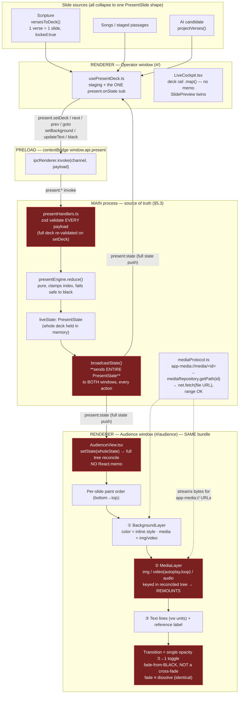
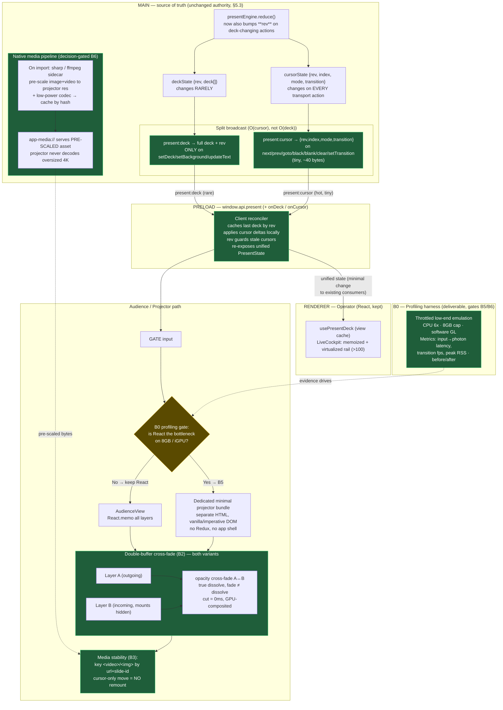

# Display-Rendering Engine — Architecture Diagrams

> Companion to [`plan/prompt.md`](../prompt.md). Produced from a first-hand read of the
> engine (not the brief's audit alone) on 2026-06-29. Two diagrams: **(1)** how slides
> are rendered today, **(2)** the proposed re-architecture for low-end hardware.

---

## What was verified in code (evidence, not assertion)

The hot path, traced end to end:

> operator key → `usePresentDeck` → `window.api.present.next()` →
> `ipcRenderer.invoke('present:next')` → `presentHandlers` (zod-validate) →
> `dispatchPresent()` → pure `reduce()` → **`broadcastState()` ships the *entire*
> `PresentState` (whole `deck` + index + mode + transition) to BOTH windows** on
> `present:state`.

| Brief audit point | Status | Evidence |
| --- | --- | --- |
| #1 Full-deck rebroadcast on every transport action | **Confirmed** | `broadcastState()` sends `liveState` whole — `windowManager.ts:149-155`, `168-171`. Only `index` changed. |
| #2 Transition change re-sends the whole deck | **Confirmed** | `setTransition` round-trips through `present.setDeck(live.deck, …)` — `usePresentDeck.ts:135-143`. |
| #3 Audience is same bundle, unmemoized | **Confirmed** | `onState` → `setState(wholeState)` reconciles the whole tree — `AudienceView.tsx:38`. No `React.memo` on the path. |
| #4 Transitions are NOT cross-fades | **Confirmed** | Single opacity layer toggles 0→1, incoming fades *from black* — `AudienceView.tsx:87-94`. `fade` ≡ `dissolve`. |
| #5 Media remounts on every render | **Confirmed** | `/<video>` keyed inside the reconciled tree — `AudienceView.tsx:141-168`. A deck rewrite remounts media even when the URL is unchanged. |
| #6 No memo/virtualization on deck rail | **Confirmed** | `state.deck.map(...)` with no memo — `LiveCockpit.tsx:204`. |
| #7 zod re-validates large payloads on the hot path | **Confirmed** | `setDeckInput` re-parses the full deck array in `presentHandlers.ts:23`. |

### The gap the brief omits

**There is no "document" slide type at all.** `SlideMedia.kind` is only `image | video | audio`
(`present.ts:9`); backgrounds are `color | media` only. There is **no PDF/PPTX/DOCX render path
anywhere** (grep-confirmed). Every slide — scripture, song, AI candidate — collapses to one
`PresentSlide` shape and is painted by the same layered surface:

> **background layer → media layer → text lines → reference label**, over a radial-gradient surface.

So "how does a document slide get rendered?" — today it does not. That is a net-new render path to
decide on explicitly, not an existing path to optimize.

---

## Diagram 1 — Current rendering engine (as built)

Red = confirmed throughput/latency hot spots. The `app-media://` protocol is the only "native-ish"
piece today; everything else is React-in-renderer.

---

## Diagram 2 — Proposed re-architecture

Spine = the brief's deck/cursor split, extended with the two pieces that actually move the needle on
15-year-old hardware: a **double-buffer cross-fade** and a **native media pre-scale-on-import
pipeline** (decode 4K once at import, never at show time). React is kept on the operator side; the
projector's React-vs-no-React choice is a **measured decision gate** (B0 → B5), not an assumption.

---

## Mapping to the candidate task outline (`prompt.md` §5)

| Diagram 2 node | Task | Notes |
| --- | --- | --- |
| Throttled emulation + metrics | **B0** | Do first — every later decision is gated on these numbers. |
| `present:deck` / `present:cursor` split + reconciler (green) | **B1** | Security review required (§7 — IPC/main/preload). `rev` guards stale cursors. |
| Double-buffer cross-fade (DBUF) | **B2** | True `fade` ≠ `dissolve`; fail-safe-to-black preserved. |
| Media stability (STAB) | **B3** | Key media by url+slide-id; no `<video>` remount on cursor moves. |
| Memoized/virtualized rail (OPVIEW) | **B4** | Coordinate with the `ux1` right-pane workstream — it may already restructure the rail. |
| Decision gate → minimal projector bundle (MINI) | **B5** | Only if B0 shows React is the bottleneck. |
| Adaptive media pipeline (NATIVE) | **B6** | sharp/ffmpeg on import; likely the single biggest low-end win. Now also covers **ingest guard rails** + **per-machine rendition selection** (see below). Expands the §0 Rust-scope — propose explicitly. |
| Capability probe → tier (CAPS) | **B6a** | Startup probe (GPU/RAM/HW-decode/benchmark) + operator override; drives rendition + effect tier and informs the B5 React gate. |
| Reducer/reconciler/transition tests + e2e | **C** | Keep every existing test green throughout. |

---

## Adaptive media pipeline + ingest guard rails (B6 detail)

Two requirements drove this out of the simple "pre-scale on import" sketch: **(a)** a huge
file on a weak machine must never crash the service, and **(b)** capable machines must not be
punished by being clamped to the lowest common denominator. Full diagram:
[`media-pipeline.mermaid`](media-pipeline.mermaid).

### (a) Huge-file guard rails — *file size never equals a crash*

The crash vector is loading a whole file into memory; we never do. Both the existing
playback path and the new import path are streamed:

- **Playback already streams.** `app-media://` uses `net.fetch` on a file URL with **range
  requests** ([mediaProtocol.ts:33](../../src/main/windows/mediaProtocol.ts#L33)) — Chromium
  buffers seconds, not the whole file. A large video *playing* is decode-bound, not RAM-bound.
- **Import streams.** ffmpeg/sharp read progressively; RAM is bounded by codec buffers, not
  file size. So the real costs of a 30 GB file are **time, CPU, disk** — guarded by:
  1. **Out-of-process sidecar**, mem/thread-capped, with **watchdog + timeout + cancel**;
     crash-isolated so a transcode failure can never take down the live app (§5.7).
  2. **Pre-flight checks** on import: size, duration, **free disk**. Large → warn + background
     optimize; beyond an absurd (configurable) ceiling → friendly refusal, never a freeze.
  3. **Serialized optimize queue** (1–2 concurrent) so bulk import can't thrash a 4 GB box.
  4. **LRU eviction to a disk budget** on the rendition cache — never fills a small SSD.
  5. **Fallback**: if optimization can't run (no disk / odd codec / cancelled), stream the
     **original**, GPU-downscaled. Degraded but alive, still fail-safe-to-black on real error.

### (b) Adaptive selection — *adapt, don't punish; clamp to the projector*

- **Projector resolution is the ceiling, and reaching it is free.** You cannot display more
  pixels than the projector has; downscaling a 4K source to a 1080p projector is visually
  lossless and cheaper for everyone. We clamp **to** the projector, never below it, never
  upscale.
- **Keep the original; renditions are an additive cache** (a small ladder: projector-native
  high-quality + a low-power light rendition), keyed by resolution+codec.
- **Capability probe at startup** (GPU, RAM, hardware-decode support, a quick benchmark; with
  a **manual operator override** — auto-detect can be wrong) assigns a **tier**. Show-time
  rendition = `f(tier, projector res, source)`: strong box + 4K projector → high rendition +
  full GPU cross-fades; 15-year-old box → light rendition + conservative transitions. The tier
  also drives frame-rate cap and the HW-accel-on/off Chromium flag — which is exactly why B0
  **measures** (some old GPUs are faster in software).

> **Slogan for the memo:** *Adapt, don't punish. Clamp to the projector, never to the weakest
> machine. A giant file may be slow to optimize, but it can never crash the service.*

### Recommendation

Stand up **B0 first** so the architecture is chosen on measured evidence (CPU 6× / 8 GB / software
GL), then proceed B1 → B2 → B3 in order. B5/B6 are decision-gated on B0. Treat the **document/PDF
render path** as a separate explicit decision (own task or formally out of scope) — it is not an
optimization of an existing path.
